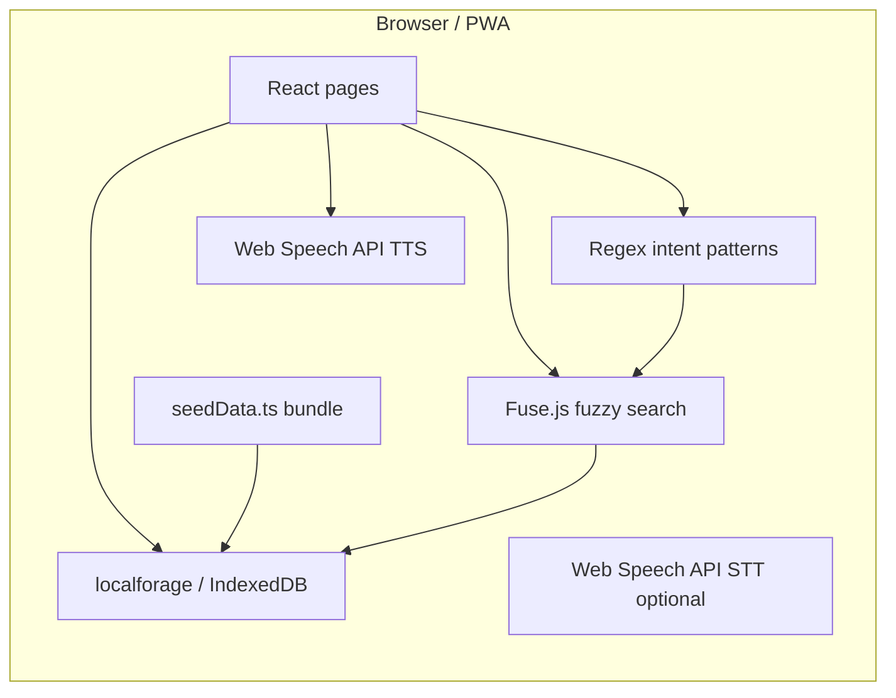
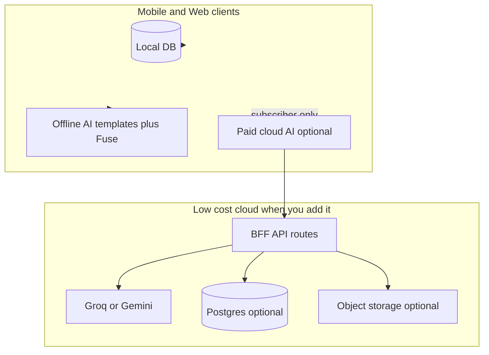

# Lingua architecture today, and roadmap to mobile + ASEAN + freemium AI

> **Location:** This copy lives in-repo at `docs/LINGUA_ARCHITECTURE_AND_MOBILE_ROADMAP.md` (committed with the app). Cursor may also keep a copy under `~/.cursor/plans/`.

## How it works locally without internet or an AI model

**There is no server-side “brain” required for the core experience.** The app is a Next.js client that ships JavaScript and static assets; language data and most logic live in the browser.

1. **Data storage** — [`src/lib/db.ts`](../src/lib/db.ts) uses **localforage** backed by **IndexedDB**. On load, [`initializeDatabase()`](../src/lib/db.ts) seeds languages, words, stories, and community posts from [`src/lib/seedData.ts`](../src/lib/seedData.ts). Dictionary browse, profile mock data, archive, notifications, etc. read/write in the same client stores.

2. **“AI” chat without a model** — [`src/lib/offlineAI.ts`](../src/lib/offlineAI.ts) does **not** call an LLM for the offline path. It:
   - Parses user text with **regex intent patterns** (translate, define, list, stats, …).
   - Runs **Fuse.js** over words already in IndexedDB for fuzzy matching.
   - Returns **template strings** built from those results.

3. **“Hybrid” online path** — [`hybridChat`](../src/lib/offlineAI.ts) checks `navigator.onLine` and tries `POST /api/ai/chat`. In the **current repo**, an `api/ai/chat` route is **not present** (only [`src/app/manifest.json/route.ts`](../src/app/manifest.json/route.ts) exists under `app`). So the fetch fails or 404s and the app **falls back to the same offline pipeline**. Net effect today: **Learn chat works fully offline with no API keys.**

4. **PWA / caching** — If `next-pwa` (or similar) is configured in [`next.config.js`](../next.config.js), static chunks and shell can be cached for repeat visits. First install still needs a network fetch unless everything is precached; **dictionary content is local after seed**, so browsing works offline once the app has loaded at least once.

## How pronunciation works

**Device TTS, not cloud.** [`src/lib/speechUtils.ts`](../src/lib/speechUtils.ts) uses the **Web Speech API** (`SpeechSynthesisUtterance` + `speechSynthesis.getVoices()`). It picks a **Filipino/Tagalog voice** when the OS/browser exposes one, with fallbacks (e.g. other regional voices), and tweaks **rate/pitch** for clearer playback.

- **Quality and accent** depend on **what voices the user’s device installed** (iOS, Android, desktop differ widely).
- **No server** generates audio; there is no custom neural TTS in-app unless you add one later (paid or heavy).

[`VoicePreloader`](../src/components/VoicePreloader.tsx) (if still in layout) warms voice lists because voices load asynchronously on some browsers.

## “Backend” and infrastructure (honest picture)

| Layer | Role today |
|--------|------------|
| **Hosting (e.g. Vercel)** | Serves HTML/JS/CSS; optional future API routes |
| **IndexedDB** | Real “database” for languages/words/user content in-browser |
| **External APIs** | Optional future: Groq/Gemini/YouTube/etc. — **not required** for core offline loop |
| **Auth** | [`src/lib/auth.tsx`](../src/lib/auth.tsx) is **mock/local** — no shared user DB |

So: **infrastructure is mostly static hosting + client storage.** A production “real” backend would add: auth, Postgres/Supabase, object storage for audio, sync queues, and API routes — only when you outgrow pure offline-first.

## Apple Intelligence vs Groq vs Gemini

- **Apple Intelligence** — Not a generic “drop in” cloud API for third-party apps like Groq. Apple exposes **limited, platform-specific** capabilities (and policies change by iOS version). You can plan **on-device enhancements where Apple documents public APIs**, but you should **not** bet the product solely on “Apple Intelligence replaces our LLM” without reading current Apple developer docs for your target iOS version. Practical approach: **use Apple’s on-device speech/TTS/STT where it helps**, keep **cross-platform** path (Groq/Gemini or self-hosted) for Android and web.

- **Groq** — Very fast, cheap/free tiers; great for **short chat + RAG** (you inject dictionary context from your DB). Good default for **online** assistive features.

- **Gemini** — Strong for **multimodal** (e.g. future: video/caption understanding, longer context on some tiers). Free tiers exist but have quotas; read current Google AI pricing.

**Are Groq + Gemini enough?** For this app’s typical features (chat help, flashcard enrichment, light moderation, transcription assist): **yes**, if you architect with **RAG over your own dictionary**, rate limits, and **graceful offline fallback** (what you already have with Fuse + templates).

## Improving with low or no cost

1. **Keep offline-first as default** — Preserve [`offlineAI.ts`](../src/lib/offlineAI.ts) as the **canonical** behavior when offline, rate-limited, or unsubscribed.
2. **Implement `/api/ai/chat` only when ready** — Single route that calls Groq (or Gemini) with **strict system prompt + dictionary snippets**; no keys on client.
3. **Sync later, not first** — Start with **export/import JSON** or “share backup” for zero server cost; add sync when budget allows.
4. **Moderation** — Rule-based + small model calls only when online; offline queue for review.
5. **Observability** — Free tier analytics (privacy-conscious) when you need product metrics.

## Migrating to React Native (App Store + Play Store)

**Recommended path: Expo (React Native)** — One codebase; **Xcode** is still used under the hood for iOS builds (EAS Build or local `eas build`), but you rarely maintain a separate native-only app unless you need it.

| PWA piece | React Native replacement |
|-----------|---------------------------|
| IndexedDB / localforage | **expo-sqlite**, **WatermelonDB**, or **MMKV** + structured stores |
| `hybridChat` / Fuse | Same JS libraries (Fuse works in RN) or SQLite FTS |
| Web Speech TTS/STT | **expo-speech**; **@react-native-voice/voice** or platform APIs for STT |
| MediaRecorder | **expo-av** |
| PWA service worker | **Background sync** patterns differ; use **prefetch + local DB** |
| Next.js routing | **expo-router** |

**Phased migration (lower risk, lower cost):**

1. **Extract shared core** — Types, `offlineAI` logic, seed merge rules into a small **shared package** (`packages/core`) used by Next and later by Expo.
2. **Run Expo shell** — Rebuild screens incrementally; ship **MVP**: dictionary + contribute voice + offline chat.
3. **Store listing** — Apple Developer Program + Google Play Console; privacy policy; optional account deletion flow if you add accounts.
4. **Optional: Capacitor** — Wrap existing Next export as a hybrid app **faster** but with WebView tradeoffs; RN is **more mobile-native** long-term.

## Rebrand: Lingua (ASEAN), not Lingua PH

- **Product**: rename strings, bundle id, store listing, [`manifest`](../src/app/manifest.json/route.ts), logos — **data model** already has `region` / `province`; extend with **`country` / `locale`** for ASEAN.
- **Content**: separate **seed packs per country** (or lazy-loaded JSON) to keep initial app size reasonable.
- **i18n**: app UI strings in English + local languages over time (`react-i18next` or similar).

## Freemium: free download, preserve mission, paid AI

**Free (aligned with remote / offline users):**

- Full offline dictionary browse, search, flashcards from local data, contribute with **local save**, TTS using device voices, offline “chat” using current **template + Fuse** behavior.

**Paid (online-only or subscription):**

- **Cloud LLM** tutoring, richer explanations, mnemonic generation, batch flashcard enhancement, video/caption AI, **cross-device sync**, optional **higher-quality** TTS if you add a provider later.

**Enforcement:** feature flags from a minimal backend or **StoreKit / Play Billing** subscription that unlocks API calls; client remains untrusted — **server validates** subscription before issuing model tokens or proxying to Groq/Gemini.

---

## New repository for production (Expo, mobile-first)

**Goal:** A **clean production repo** whose default branch builds the **store app** (Expo + EAS), with secrets, bundle IDs, and CI separate from experiments and the old PWA.

**Recommended layout (small team):**

1. **Create a new GitHub repository** (e.g. `lingua-app` or under an org `lingua-hq/lingua-mobile`).
2. **Keep the existing PWA repo** as **legacy / web** or archive when the mobile app replaces it for users; avoid mixing unrelated histories if you want simpler EAS and store credentials.
3. **Share code without merging repos (pick one):**
   - **Private npm package** `@lingua/core` (types, `offlineAI`, Fuse config, validation) published from a `packages/core` folder in either repo until you split; or
   - **Git submodule** pointing at a tiny `lingua-core` repo; or
   - **Monorepo later** (`apps/expo`, `apps/web`) — more setup, best long-term if you maintain web + mobile equally.

**Repo contents (production mobile):**

- Expo SDK, `expo-router`, `app.config.ts` / `eas.json`, environment profiles (`development`, `preview`, `production`).
- **No** Next.js in this repo unless you deliberately add a small web export later.
- CI: GitHub Actions → EAS Build on tag or `main`; TestFlight / internal testing tracks.

**Naming / stores:** New bundle id `com.yourorg.lingua` (not `lingua-ph`) aligned with ASEAN rebrand; separate Apple Team and Play Console app entry.

---

## Feature matrix: offline free vs online vs subscription (AI)

Legend: **Offline** = works with no internet after initial install/cache. **Online free** = needs network but no paywall. **Lingua+ (subscription)** = paid AI or heavy cloud features.

| Feature area (from current PWA) | Offline free | Online free | Lingua+ (subscription) |
|----------------------------------|--------------|-------------|-------------------------|
| Browse / search languages & dictionary | Yes | Yes | — |
| Word detail, categories, stories (bundled seed) | Yes | Yes | — |
| **Device TTS** pronunciation | Yes | Yes | — |
| **Record voice** contribution (save locally) | Yes | — (sync later optional) | Optional: cloud backup of audio |
| **Text contribution** (local) | Yes | Sync when you add accounts | — |
| **Learn: flashcards** from local dictionary | Yes | — | Optional: AI-expanded cards, mnemonics |
| **Learn: “chat”** (Fuse + templates, [`offlineAI.ts`](../src/lib/offlineAI.ts)) | Yes | — | **Cloud LLM** tutor (richer answers, follow-ups) |
| **Learn: News & articles** (opens external URLs) | — | Yes | — |
| **Community** tab (read bundled / cached posts) | Partial | Full if server-backed | — |
| **Confirm / flag** (local moderation demo) | Yes | Real moderation when server exists | Optional: AI assist moderation |
| **Archive / bookmarks** (stories) | Yes | — | — |
| **Profile** (stats, settings, legal) | Yes | Account sync when added | — |
| **Swadesh / guided lists** (content-driven) | Yes | — | Optional: AI-generated drills |
| **Pronunciation practice** (client-side) | Yes | — | Optional: AI feedback on accuracy |
| **Last Voice** (guided sessions) | Yes | — | Optional: cloud session backup |
| **Language health / volunteer** dashboards | — | Yes (static or API) | — |
| **Extract video / YouTube** | — | Unlikely free long-term | **Strong candidate**: transcription + LLM extraction (cost + abuse) |
| **Cross-device sync & account** | — | Free tier limited | Full sync often bundled with Lingua+ or separate |

*Adjust rows when you add real auth and a server; the principle stays: **preservation path stays offline and free**.*

---

## Features to remove, defer, or demote (focus + cost)

**Strong candidates to cut from v1 mobile MVP**

- **Duplicate or low-traffic surfaces:** e.g. standalone [`community/[lang]`](../src/app/community/[lang]/page.tsx) if the same exists inside dictionary — ship **one** community UX.
- **Volunteer matching + health dashboard** — Valuable for partners and grants, but **not** core for a learner in a hut with no signal. Ship as **web-only**, **Phase 2**, or a **lightweight static** page.
- **“AI progress” purely decorative cards** — Keep only if they reflect real data; otherwise simplify to reduce noise.

**Keep core v1:** Dictionary, Learn (flashcards + offline chat), Contribute (voice + text), Profile, basic notifications/archive, TTS, seed packs.

**Extract video (YouTube / upload) — necessary?**

- **Not required** for the mission statement (learn + preserve + record offline). It is a **power user / archivist** feature.
- **Implementation difficulty:** **Medium to hard** on mobile — large files, background upload, caption APIs or ASR, LLM prompt to propose vocabulary, **human review**, legal/ToS for YouTube, ongoing API cost.
- **Pricing:** Making it **Lingua+ only** (or a capped monthly quota) is reasonable: it directly drives **Groq/Gemini + storage + egress** cost and abuse risk.

**What happens after “extraction” (product clarity)**

Intended flow (do **not** auto-merge into the public dictionary without review):

- **Extract** step proposes **candidate words/phrases** with glosses; humans fix orthography and meaning.
- **Queue** = your moderation/contributions pipeline (today local; production = server + curator tools).
- **Dictionary** = only after **approve** — optionally **device-local** for that user first, then **global** when synced and accepted.

So: extraction is **not** “magic fill dictionary”; it is **assist to populate a review list**.

---

## Migration development plan (phased)

| Phase | Scope | Outcome |
|-------|--------|--------|
| **0 — Foundation** | New repo, Expo + TypeScript, design tokens, navigation shell | Empty runnable app on device |
| **1 — Data core** | SQLite (or WatermelonDB) + seed import + FTS or Fuse | Dictionary works offline |
| **2 — Core UX** | Dictionary detail, TTS (`expo-speech`), Contribute voice/text | Parity with main user journeys |
| **3 — Learn** | Flashcards + port `offlineAI` | Offline chat works |
| **4 — Accounts & sync** (optional v1.5) | Auth + API + Postgres | Multi-device, real contributions |
| **5 — Lingua+** | StoreKit / Play Billing + BFF + Groq/Gemini | Paid AI features |
| **6 — ASEAN** | Country packs, lazy download, i18n | Scalable content |

Run **TestFlight / internal testing** after Phase 2–3; public store after billing and privacy review if you ship subscriptions.

---

## Lingua+ pricing, credits, and subscription shape (draft — not financial advice)

**Goal:** Affordable for many Filipino and indigenous users, yet **high enough** that average usage does not exceed **your LLM + infra margin**. Treat numbers below as **starting hypotheses**; run a **short survey** (community leaders, students) and watch **actual token burn** in staging before locking store prices.

### Offer both monthly and yearly

- **Monthly:** lower commitment; good for trials and irregular income.
- **Yearly:** **~15–25% discount vs 12× monthly** (common pattern); improves cash flow and retention.
- **Do not offer yearly-only** at launch — monthly builds trust; add yearly once monthly pricing is validated.

Illustrative **Philippines-oriented** anchors (adjust after cost modeling):

| Tier | Monthly (PHP, illustrative) | Yearly (illustrative) | What it could include |
|------|-----------------------------|------------------------|------------------------|
| **Free** | — | — | Full offline core; offline dictionary chat (Fuse/templates); no cloud LLM |
| **Lingua+** | **₱79 – ₱149 / mo** band | **~₱799 – ₱1,499 / yr** (discounted) | Monthly **AI credits** (below) + cloud chat + optional extraction quota |

- If costs or abuse are high, start **closer to the top** of the band; you can run **intro promos** (first month discount) instead of permanently underpricing.
- **Institutional / NGO** seats can be **separate invoicing** (not only App Store) so schools are not limited to consumer IAP.

### Credits per month (recommended)

Use **credits** so one “video job” cannot bankrupt you if someone runs long files.

**Example buckets (tune after telemetry):**

- **AI chat messages** (cloud LLM): e.g. **30–100 assistant replies / month** per subscriber (count only **successful** API calls; offline answers are free).
- **Video extraction jobs**: e.g. **1–3 jobs / month** included, each job capped by **max duration** (e.g. 10–15 min) and/or **max megabytes**; **over-cap = top-up or wait**.

**Optional:** small **rollover** (e.g. up to 50% of monthly chat credits) to feel fair — increases liability; v1 can be **no rollover** (simpler).

### When credits run out before the next renewal

1. **Hard stop for paid cloud features only** — App stays usable: **offline dictionary, offline chat, record, flashcards** unchanged.
2. **Clear UI:** “You’ve used this month’s Lingua+ credits. Resets on [date].”
3. **Options (pick one or combine):**
   - **Wait** until monthly reset (simplest, no extra SKUs).
   - **Consumable in-app purchase:** e.g. “+20 AI chats” or “+1 video job” (Apple/Google take ~15–30%; price packs so margin remains positive).
   - **One-time booster** for heavy users only — avoids forcing everyone to a higher subscription tier.

Avoid silent failures; never block **free** paths.

### Video extraction vs chat (pricing logic)

- **Video** is **more expensive** (storage, ASR, longer context, more tokens). Keep it **inside Lingua+** but **separate sub-quota** or **higher credit cost** (e.g. 1 job = 10 chat credits) so chat-heavy users do not drain video budget and vice versa.

---

## Are Groq and Gemini enough — including fallback — and are they affordable?

**Yes, as a pair, they are a sensible production stack** for this product class, if you keep **prompts short**, **RAG snippets small**, and **strict output limits**.

| Role | Typical use |
|------|-------------|
| **Groq** | Primary **low-latency** chat completions (good UX for tutoring turns). |
| **Gemini** | **Fallback** when Groq returns 429/rate limit/errors, or for **multimodal / longer** tasks (e.g. summarizing transcript chunks for video extraction) if you choose that split. |

**Affordability (conceptual):**

- Both vendors publish **list pricing** and **free/dev tiers**; exact **$/1M tokens** changes — re-check at launch.
- Your **margins** depend on: **credits per user**, **average tokens per message**, **video length caps**, and **subscriber count**. A **small BFF** that logs tokens per user lets you **re-price** credits or subscription yearly.

**Important:** Keys stay **server-side only**; the app calls **your API**, which calls Groq or Gemini. Fallback is **automatic** on the server (try A, then B), transparent to the user except maybe slightly higher latency on fallback.

---

## AI chat: context framing so users cannot treat it as “general ChatGPT”

Implement **defense in depth** (product + server; not prompt-only):

1. **System prompt (mandatory):** Assistant is **only** a **language preservation and learning tutor** for **Lingua** content; it must **refuse** homework for unrelated subjects, medical/legal advice, politics, coding unrelated to the app, etc., with a **short redirect** (“I can help with words, phrases, culture notes, and practice for languages in Lingua…”).
2. **Retrieval-only or grounded context:** Inject **only** small snippets from the user’s **selected language dictionary / stories** + user message; **cap total context** (e.g. max tokens / max chars) so the model cannot “free roam.”
3. **User-visible scope:** Label the UI **“Lingua tutor (languages only)”** and show **remaining credits** so expectations match behavior.
4. **Lightweight classifier (optional, cheap):** A **tiny model** or rules-based pre-check flags obvious off-topic prompts → **no LLM call** (save money) → canned refusal.
5. **Hard caps:** **Max message length**, **max assistant length**, **max turns per minute** per account to limit abuse and cost.

Free tier continues to use **offline** [`offlineAI.ts`](../src/lib/offlineAI.ts) behavior (already bounded by dictionary data).

---

## Migrating the current PWA to Expo with the same behavior and look

**“Exactly the same” pixel-for-pixel is rare** in React Native (different fonts, safe areas, keyboard, navigation). Aim for **same brand, layout intent, and feature parity**; document acceptable deltas.

**Functional parity (checklist approach):**

1. **Inventory screens** from the PWA (`app/*/page.tsx`) and **map each to an Expo route** (`expo-router`).
2. **Port data layer first:** seed JSON or SQLite load matching [`db.ts`](../src/lib/db.ts) semantics (languages, words, stories, profile, chat, archive — trim if v1 defers health/volunteer).
3. **Port business logic:** [`offlineAI.ts`](../src/lib/offlineAI.ts), Fuse config, contribution validation — ideally **`@lingua/core`** shared package.
4. **Rebuild UI** screen-by-screen against **screenshots + Tailwind class list** from the PWA (not from memory).

**Visual parity:**

1. **Design tokens:** Extract **colors** (e.g. brand `#0A84FF`), **radii** (`rounded-2xl` → 16), **spacing scale**, typography sizes from [`globals.css`](../src/app/globals.css) / Tailwind theme into a **single `theme.ts`** used by RN.
2. **Styling in RN:** **NativeWind** (Tailwind-like classes) or **Tamagui** — speeds up matching the PWA’s utility style.
3. **Components:** Recreate **BottomNav**, **cards**, **modals** (Radix patterns → RN modal / bottom sheet), **tabs** — same **information hierarchy**.
4. **Assets:** Reuse **logo**, icons (e.g. **lucide-react** → **lucide-react-native**), illustrations.
5. **Dark mode:** Same `data-theme` or appearance strategy → **React Native Appearance** + token swap.

**Order of work:** Data + offline chat + dictionary + contribute **first** (core mission); **animations** (Framer Motion → Reanimated) **second** so you do not block parity on motion.

---

## Production on App Store & Play Store + traction, ROI, MRR

**Launch mechanics**

- **Apple:** Developer Program (~annual fee), App Store Connect, privacy nutrition labels, **encryption export** questionnaire, optional Sign in with Apple if other social logins exist.
- **Google:** Play Console, one-time registration fee, **Data safety** form, target API level compliance.
- **Build:** EAS Build (Expo); store signing credentials in EAS, not in git.

**Traction (realistic for language-preservation apps)**

- Viral consumer growth is **limited**; prioritize **institutions** (schools, cultural orgs, NGOs), **government/adjacent partners** in ASEAN, **university linguistics**, and **grant-funded** pilots.
- **Content:** short demos (TikTok/Reels) showing **offline + record a word in 10 seconds** resonate more than abstract AI.
- **ASO:** “indigenous language”, “offline dictionary”, per-country keywords; localized store listings per ASEAN market over time.

**ROI and MRR (monthly recurring revenue)**

- **MRR** from subscriptions will likely start **small** unless you have distribution (partners, ads spend, or viral loop). Treat **Lingua+** as **margin on power users and institutions**, not the only sustainability lever.
- **Other levers:** grants, **B2B** (white-label dictionary for a province/ministry), **donations**, **sponsored content packs** (ethical, disclosed).
- **KPIs:** weekly active recorders, entries approved per month, **offline session length**, retention D7/D30, conversion to Lingua+ if AI is clearly valuable.

This plan keeps **mission (free offline core)** credible while positioning **paid AI** and **video extraction** as optional, cost-aligned upgrades.

---

## React Native Expo: how to start, what to install, free stack

### What to download / install (development)

| Tool | Why | Cost |
|------|-----|------|
| **Node.js** (LTS, e.g. 20.x) | JS runtime for Expo CLI and Metro | Free |
| **Git** | Version control | Free |
| **Cursor / VS Code** | Editor | Free tier OK |
| **Expo CLI / npx** | `npx create-expo-app@latest` — no global install required | Free |
| **Expo Go** (iOS App Store / Play Store) | Scan QR to run dev build on a real phone quickly | Free |
| **Xcode** (macOS only) | iOS Simulator + required for **local** iOS builds and App Store uploads if not using only EAS cloud | Free (Mac App Store) |
| **Android Studio** (optional but useful) | Android Emulator + SDK/platform tools | Free |
| **EAS CLI** (`npm i -g eas-cli`) | Cloud builds, submit to stores (`eas build`, `eas submit`) | Free tier limited; paid when you outgrow |

You can **start without** Android Studio if you use a **physical Android device + Expo Go**. For **iOS device testing without a Mac**, use **EAS Build** (cloud) + TestFlight.

### How to start the Lingua Expo app (migration path)

1. **New repo** (recommended): `npx create-expo-app@latest lingua-mobile` with **TypeScript** template.
2. Add **expo-router** for file-based routes (closest mental model to Next.js `app/`).
3. **Port shared logic** from this PWA: copy or extract `offlineAI`, types, Fuse usage, seed JSON into `packages/core` or a `shared/` folder.
4. **Data on device:** `expo-sqlite` or WatermelonDB; import the same seed shape as [`src/lib/db.ts`](../src/lib/db.ts).
5. **Parity pass:** one screen at a time (Dictionary → Contribute → Learn → Profile) using design tokens from [`globals.css`](../src/app/globals.css).

### Free (or mostly free) tech stack for v1

| Layer | Suggested free / low-cost option |
|--------|----------------------------------|
| **App framework** | Expo (SDK) + React Native |
| **Routing** | expo-router |
| **Local DB** | expo-sqlite / WatermelonDB |
| **Styling** | NativeWind or StyleSheet + your tokens |
| **Icons** | lucide-react-native |
| **Builds / CI** | EAS free tier (limited builds/month); scale up when revenue exists |
| **Backend (later)** | Vercel serverless free tier, Cloudflare Workers, or Supabase free tier |
| **Auth (later)** | Supabase Auth, Clerk free tier, or Firebase (watch quotas) |
| **DB (later)** | Supabase Postgres free tier, Neon free tier |
| **File storage (audio)** | Cloudflare R2 free egress-friendly tier, Supabase Storage |
| **LLM proxy** | Groq + Gemini free/dev tiers with strict caps; server-side only |
| **Subscriptions (recommended)** | **RevenueCat** (free up to $2.5k MTR historically — verify current pricing) **or** native StoreKit/Play Billing with your own small API |

Always re-check **vendor pricing pages** before launch; free tiers change.

---

## Do you need an admin dashboard?

**Not for the very first MVP** (offline dictionary + contribute only). **Yes, once you ship real subscriptions, accounts, and support at scale.**

| Need | Without a custom admin app | With an admin dashboard |
|------|---------------------------|-------------------------|
| **“Why was I charged?”** | Email + manual lookup in App Store Connect / Play Console | Faster: link subscription ID to user in your DB |
| **Refunds** | Mostly handled in **Apple/Google** consoles (policies apply) | Same, but dashboard shows **user state** and flags |
| **AI credits / abuse** | Hard without a server log UI | View usage per user, reset credits, ban |
| **Content moderation queue** | Spreadsheets / DB GUI (Supabase table editor) | Dedicated **moderator UI** for approve/reject |

**Practical minimum for subscriptions:**

- **RevenueCat** (or similar) gives a **web dashboard** for entitlements, offerings, and some customer lookup — reduces need for a **custom** admin for billing alone.
- **Supabase Dashboard** or **Neon** can be your “admin” for users/contributions in early days.
- Build a **small internal Next.js admin** (protected route, no public link) when you need **support workflows** (search user, see subscription status, see credit usage, resync entitlements).

So: **start with store consoles + RevenueCat + DB UI**; add **custom admin** when support volume justifies it.

---

## Live production: Play Store and App Store — what else you need

### Accounts and legal

- **Apple Developer Program** (paid annual) — required for App Store.
- **Google Play Console** (one-time registration fee) — required for Play Store.
- **Privacy policy** URL (host on your site or GitHub Pages) — **mandatory** in listings.
- **Terms of service** (especially for UGC, contributions, AI disclaimers).
- **Support contact** email or URL (often required or expected).
- **DMCA / content policy** if users upload text/audio (even locally synced later).

### App compliance

- **Apple:** App Privacy details, **Sign in with Apple** if you offer other third-party social login, export compliance questionnaire, **Kids** rules if under-13.
- **Google:** **Data safety** form, content rating questionnaire, target API level.
- **Subscriptions:** Clear **what users get**, **renewal terms**, link to manage/cancel subscription (Apple/Google handle billing UI partially).

### Technical

- **App icons** (all required sizes), **screenshots** per device class, **feature graphic** (Play).
- **EAS Build** credentials: iOS distribution cert + provisioning profile (EAS can manage); Android keystore (EAS can manage).
- **Environment separation:** `development` / `preview` / `production` API keys; never ship dev keys to store builds.
- **Crash reporting** (optional, free tier): Sentry free tier, or Expo updates workflow.
- **OTA updates (optional):** EAS Update for JS-only fixes without full store review (within Apple/Google rules).

### Operations

- **Analytics** (privacy-respecting): Expo insights, PostHog free tier, or minimal custom events.
- **Status page** (optional): for API/LLM outages affecting Lingua+.

---

## Summary diagram (target production)

This keeps **preservation and learning usable offline** while monetizing **optional** AI and convenience features that genuinely need the network.
